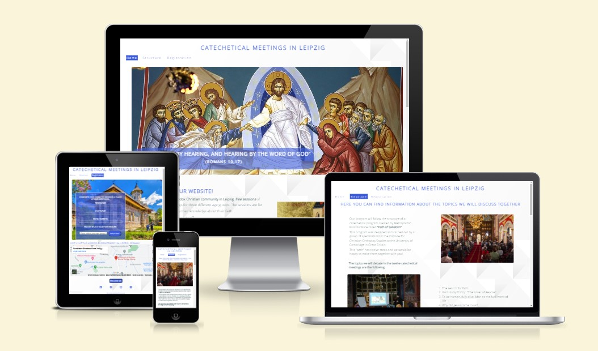

# Leipzig Orthodox Catechetical meetings #

## 1. Purpose of the project: ##

The purpose of this project is to facilitate access, in a well-organized way, to a catechetical course for believers from a certain local community.
Registration for this catechetical course will be done by completing a form on the website.
Before filling out the form, the user is given important information about the structure, cost, time and location of the catechetical course.

## 2. user stories:  ## 
By viewing this site, users will be informed about the possibility to register and participate in the free catechetical courses organized in the Church.
Users are also informed about the information taught in all twelve sections.

## 3. Features: ##

Title and menu bar:

We have a suggestive main title that shows the purpose of the site, namely to inform about catechetical meetings in the city of Leipzig.
The title is framed in an anchor element that leads to the home page.

The title and the menu are common on all four pages, in the menu I did not add the fourth page because it serves only as an answer to filling out the form.

The elements in the menu are embedded in the anchor elements, which are elements of an unordered list. The user can access any of the three main pages (Home, Structure and Registration) from the menu.

I used a class called "current" and applied style elements to indicate the page the user is on.
At the same time, I used the :hover selector to indicate the menu items as clickable links.

### Home Page

### Hero-image
Then I added the presentation image (hero-image) which is a suggestive image, showing that the site has religious content, then I added a suggestive biblical verse that indicates the importance of dialogue in the exercise of faith, this verse is framed in a div with the cover text name, that will have a keyframe applied to slide from the left side onto the hero image.

Then I wrote a welcome message, followed by some basic information about the purpose of the site, I made it clear that we offer free catechetical courses to members of a local religious community.

### Home page section

I alternated the text with an image to give a style to the page, on mobile devices the text and the image will be displayed one below the other, which is possible by using the grid properties.

The last text in this section is a list that points out the key information for the organization of catechesis.
This list has a link to the website of the local parish where the catechetical meetings take place, as well as internal links that lead both to the page with the structure of the catechetical program and to the page with the form.
The links are underlined and when we hover them they change color to signal that they are clickable.

In the last section of the home program for the following catechetical sessions, here we have included information about the time period when the meetings will take place and for which age categories.

In the footer I have included links to social media, as well as a script to be able to display icons.

### Structure Page
In the Structure Page, I wrote a short introductory text to show where we got inspiration for the structure of the catechesis, then I wrote the themes of the two meetings in two ordered lists.
I kept the same layout as on the first page and alternated the text with the image.

At the end of the page I added an iframe with a video from youtube to provide an example of catechesis to the user

### Form Page
In the Form Page, I have included a form that is displayed on a background image that represents an Orthodox Monastery in Romania.

The form has three input elements for text, a select element and finally an input submit element, all of which have the required attribute.
After completing the form and sending it, the user will be directed to a page with a confirmation message.

### Confirmation Page

This page is displayed after the correct completion of the form and contains a short message confirming the registration.

## 4. future features:
I want to add links to external sites that contain books and educational materials of the Orthodox faith, as well as the possibility of online meetings.
I would like to record the 12 catechesis to publish them on this website.
I want also to offer the possibility of online catechetical meetings

## 5. Typography and color scheme:  ## 
The color of the regular text is gray-blue (#3C565B;) and the color for titles and other highlighting elements is light blue (#3b5bdb).

I used blue because it is a predominant color in the hero image.
To highlight the links during the hover, I used light green.

The images are carefully chosen to reflect the main theme of the site of catechetical meetings and they are displayed alternately with the text, offering a pleasant user experience.

To add an extra touch of style, I also used a background pattern for the body element.

## 6. wireframes:  ## 
I will use balsamiq for a preliminary structure.

## 7. technology  ## 

## 8. testing  ## 

### Validator Testing

  #### 8.1 code validation

Home Page - https://validator.w3.org/nu/?doc=https%3A%2F%2Fbogdan131992.github.io%2FProject-1-Orthodox-Christian-Teachings%2Findex.html

Structure Page - https://validator.w3.org/nu/?doc=https%3A%2F%2Fbogdan131992.github.io%2FProject-1-Orthodox-Christian-Teachings%2Fstructure.html

Registration Page - https://validator.w3.org/nu/?doc=https%3A%2F%2Fbogdan131992.github.io%2FProject-1-Orthodox-Christian-Teachings%2Fregistration-forms.html

Confirmation Page - https://bogdan131992.github.io/Project-1-Orthodox-Christian-Teachings/confirmation.html?first_name=Bogdan&last_name=Burla&email_address=bogdanviorel13%40gmail.com&age=between+12+and+18+years

W3C CSS Validator - https://jigsaw.w3.org/css-validator/validator?uri=https%3A%2F%2Fbogdan131992.github.io%2FProject-1-Orthodox-Christian-Teachings%2Findex.html&profile=css3svg&usermedium=all&warning=1&vextwarning=&lang=en

  ### 8.2 test cases (user story based with screenshots)

   8.3 fixed bugs

   
   
   .png)
   .png)

   
   
   .png)
   .png)

   .png)
   .png)
   

   8.4 supported screens and browsers

   
## 9. Deployment  ## 
   9.1 via gitpod
   9.2 via github pages
   
## 10. credits  ## 
