# Leipzig Orthodox Catechetical meetings #

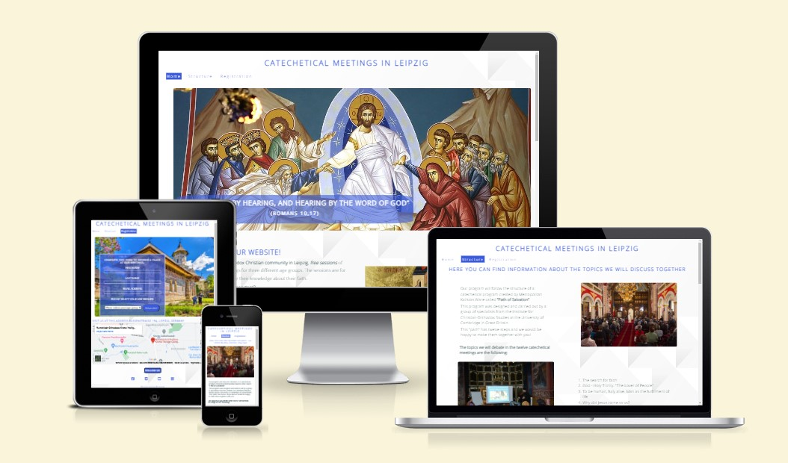
## 1. Purpose of the project: ##

The purpose of this project is to **facilitate access**, in a well-organized way, to a catechetical course for believers from a certain local community.
Registration for this catechetical course will be done by completing a form on the website.
Before filling out the form, the user is given important information about the structure, cost, time and location of the catechetical course.

## 2. User stories:  ## 

- As a visiting user, I would like to find out more information about catechetical meetings

- As a visiting user, I would like to know if I have to pay something for meetings

- As a visiting user, I would like to know the exact location of the meetings

- As a visiting user, I would like to know if I have to bring something with me to meetings

- As a visiting user, I would like to know the main topics that will be debated at the meetings

- As a visiting user, I would like to contact the community to attend their meetups

## 3. Features: ##

### Title and menu bar:

We have a **suggestive main title** that shows the purpose of the site, namely to inform about catechetical meetings in the city of Leipzig.
The title is framed in an anchor element that leads to the home page.

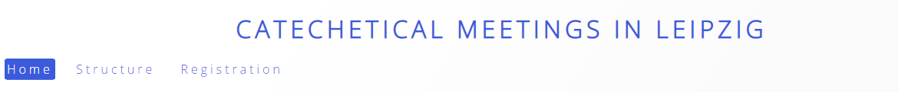

The title and the **menu are common on all four pages**, in the menu I did not add the fourth page because it serves only as an answer to filling out the form.

The elements in the menu are embedded in the anchor elements, which are elements of an unordered list. The user can access any of the three main pages (Home, Structure and Registration) from the menu.

I used a class **called "current"** and applied style elements to indicate the page the user is on.
At the same time, I used the :hover selector to indicate the menu items as clickable links.

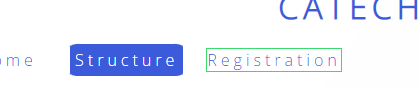

### On Home Page I have:

### Hero-image
I added the presentation image (hero-image) which is a suggestive image, showing that the site has **religious content**, then I added a suggestive biblical verse that indicates the importance of dialogue in the exercise of faith, this verse is framed in a div with the cover text name, that will have a **keyframe applied** to slide from the left side onto the hero image.

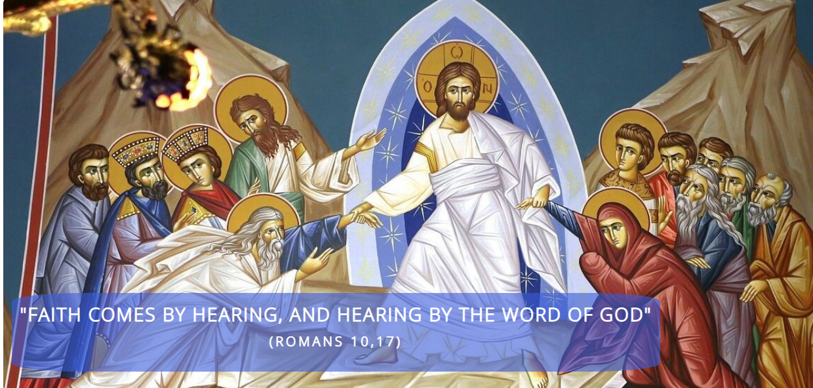

Then I wrote a welcome message, followed by some basic information about the **purpose** of the site, I made it clear that we offer free catechetical courses to members of a local religious community.

### Home page section

I alternated the text with an image to give a style to the page, on mobile devices the text and the image will be displayed one below the other, which is possible by **using the grid** properties.

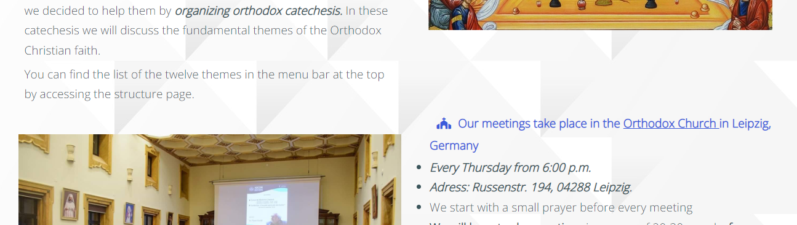

The last text in this section is a list that points out the **key information** for the organization of catechesis.
This list has a link to the website of the local parish where the catechetical meetings take place, as well as internal **links** that lead both to the page with the structure of the catechetical program and to the page with the form.
The links are underlined and when we hover them they change color to signal that they are clickable.

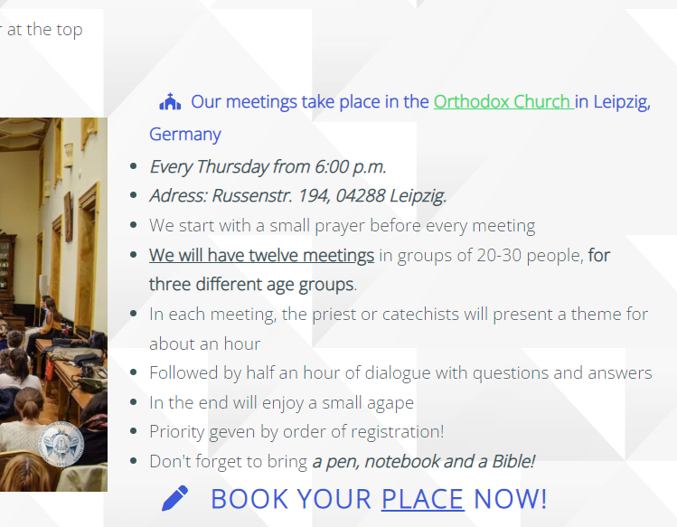

In the last section of the home program for the following catechetical sessions, here we have included information about the **time** period when the meetings will take place and for which age categories.

In the footer I have included links to social media, as well as a script to be able to display **icons.**

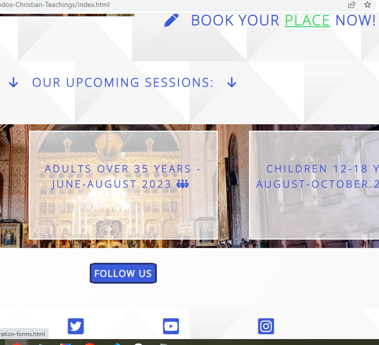

### Structure Page
In the Structure Page, I wrote a short introductory text to show where we got inspiration for the structure of the catechesis, then I wrote the **themes of the twelwe** meetings in two ordered lists.
I kept the same **layout** as on the first page and **alternated the text with the image**.

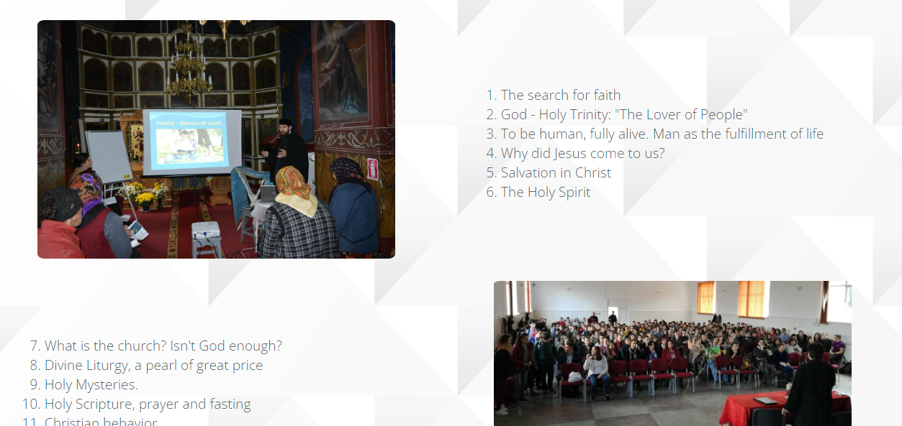

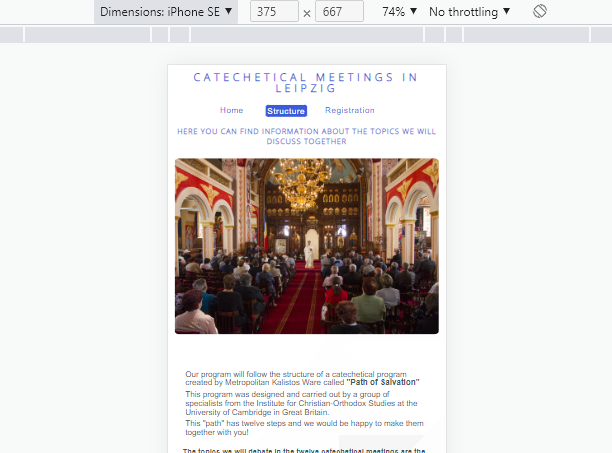

At the end of the page I added an iframe with a **video from youtube** to provide an example of catechesis to the user
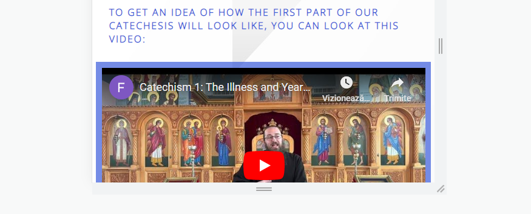

### Forms Page
In the Forms Page, I have included a form that is displayed on a background image that represents an Orthodox Monastery in Romania.

The **form has three input** elements for text, a select element and finally an input submit element, all of which have the **required attribute.**
After completing the form and sending it, the user will be directed to a page with a confirmation message.

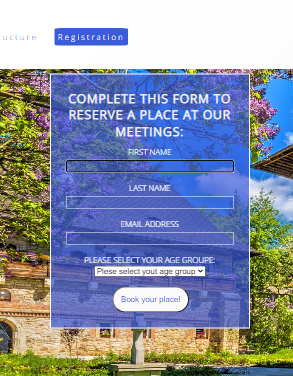

### Confirmation Page

This page is displayed after the correct completion of the form and contains a short **message confirming the registration.**

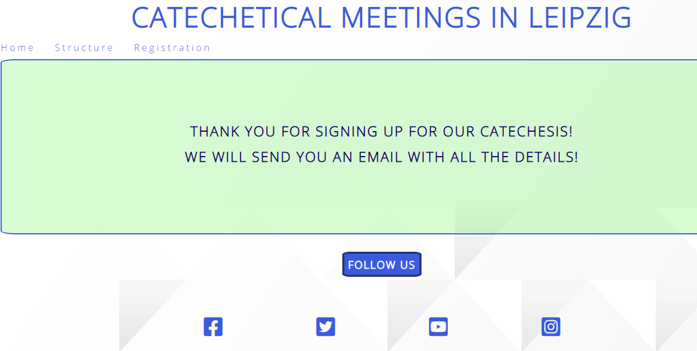

## 4. future features:
- I want to add links to external sites that contain books and educational materials of the Orthodox faith, as well as the possibility of online meetings.

- I would like to record the 12 catechesis to publish them on this website.

- I want also to offer the possibility of online catechetical meetings

## 5. Typography and color scheme:  ## 
- The color of the regular text is gray-blue (#3C565B) and the color for titles and other highlighting elements is light blue (#3b5bdb).

- I used blue because it is a predominant color in the hero image.
To highlight the links during the hover, I used light green.

- The **images are carefully chosen to reflect the main theme** of the site of catechetical meetings and they are displayed alternately with the text, offering a pleasant user experience.

- To add an extra touch of style, I also used a background pattern for the body element.

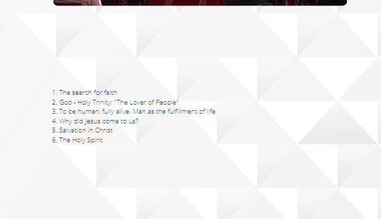

## 6. Validator Testing

  #### 6.1 code validation

- [Home Page](https://validator.w3.org/nu/?doc=https%3A%2F%2Fbogdan131992.github.io%2FProject-1-Orthodox-Christian-Teachings%2Findex.html)

- [Structure Page](https://validator.w3.org/nu/?doc=https%3A%2F%2Fbogdan131992.github.io%2FProject-1-Orthodox-Christian-Teachings%2Fstructure.html)

- [Registration Page](https://validator.w3.org/nu/?doc=https%3A%2F%2Fbogdan131992.github.io%2FProject-1-Orthodox-Christian-Teachings%2Fregistration-forms.html)  

- [Confirmation Page](https://bogdan131992.github.io/Project-1-Orthodox-Christian-Teachings/confirmation.html?first_name=Bogdan&last_name=Burla&email_address=bogdanviorel13%40gmail.com&age=between+12+and+18+years)  

- [W3C CSS Validator](https://jigsaw.w3.org/css-validator/validator?uri=https%3A%2F%2Fbogdan131992.github.io%2FProject-1-Orthodox-Christian-Teachings%2Findex.html&profile=css3svg&usermedium=all&warning=1&vextwarning=&lang=en) 

  ### 6.2 Test cases (user story based with screenshots)

- As a user, when I click on the main title, I am taken to the home page
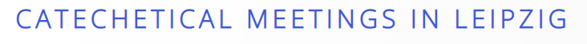

- As a user, when I hover over a name in the menu, I see that a green border appears around the name of the menu items, when I click on an item, I am taken to the corresponding page and the name of the page I am on appears in white with a blue background
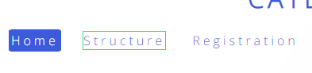

#### Home page
- As a user on the home page I see information about the purpose of the site to organize catechetical meetings
- As a user, when I'm on the home page, I see that a text slides from left to right to draw my attention to a Biblical quote
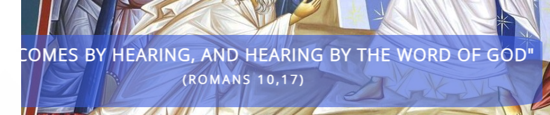

- As a user  when I hover over the underlined texts, I see that they change color to green, and if I click on them, I go to other pages.

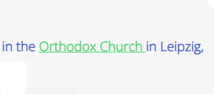

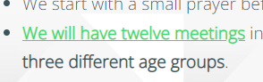

- As a user in the menu section I see three frames with the catechetical groups that will have meetings in a certain period of time

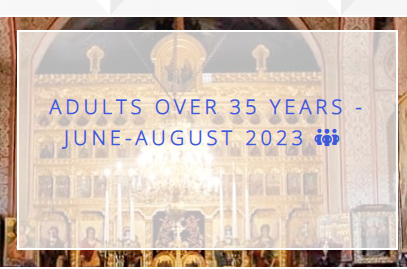

#### Footer

- As a user when I hover over the social media icons I see that they are clickable and if I click I am taken to the social media pages that open in a new tab

#### Structure Page

- As a user of the structure page, I can clearly see the themes of the twelve catechetical meetings.
- As a user, when I click play on the video on YouTube, I can see and listen to the video, and I can control the volume.

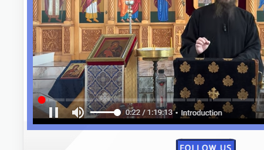

#### Registrations-forms page

- As a user, I can't click on the book your place button without writing something in the First Name field, I'm warned that I have to write something in the first field

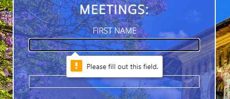

- As a user, I click on the book your place button without writing something in the Last Name field, I am warned that I have to write something in the second field

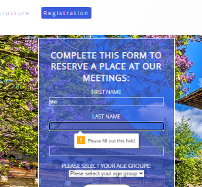

- As a user, I can't click on the book your place button without writing something in the email field, I'm warned that I have to write something in the third field

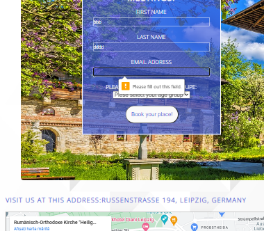

- As a user, I can't click on the book your place button without choosing the age category, I'm warned that I have to choose the age category and then click on the book button

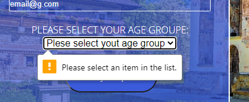

- As a user, when I click on the google map, I can enlarge or zoom in on the map and see the address of the Church where the meetings take place, marked on the map.
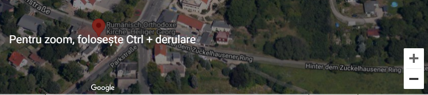

#### Confirmation Page 

- As a user, after filling out the form, I am redirected to the confirmation page where I am greeted with a massage that confirms that I have successfully registered

### 6.3 fixed bugs

Writing the arialabelledby attribute inside a div that displayed an image as background caused 53 errors when I tested the html code
   

To fix this aria bug I wrote aria-label and added role="img" attribute.

   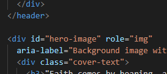
   

   Another bug was caused by the existence of two closing tags for a li element, so I removed one.
   

A bug was caused by embedding an imput submit element inside the select element, 
   .png)

So we removed the imput element from inside the select element to fix the bug
  
   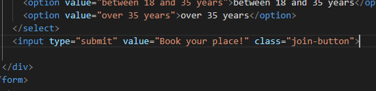

   ### 6.3 Lighthouse 

   #### Lighthouse report for  dextop
   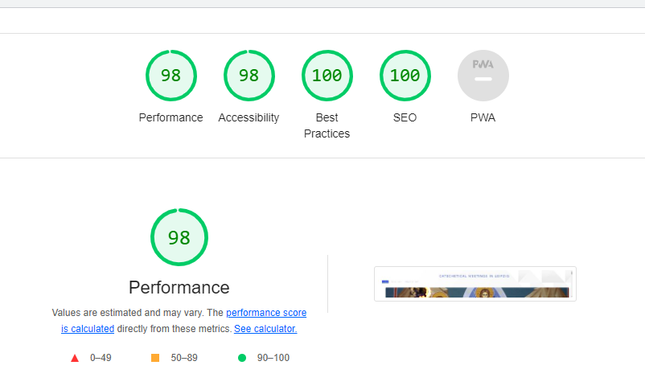

   #### Lighthouse report for mobile 
   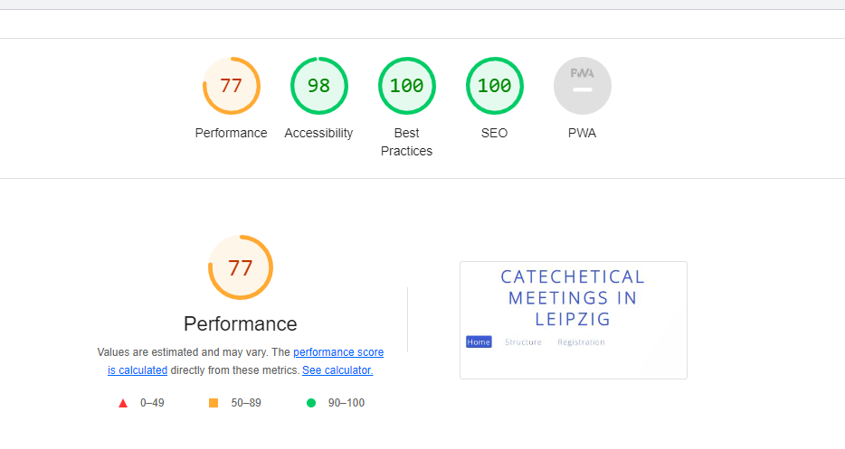

## 7. Supported screens

I used media queries (@media screen and (max-width:400px)) for the dimensions: 1200px, 950px, 400px.
To create a responsive website for all devices

   
## 8. Deployment  ## 

The steps followed for project deployment are as follows:

- In the GitHub repository I selected my project from the menu on the left.
- Then I clicked on Settings and from the settings menu on **the left** I clicked on the Pages button
- Then from the Branch section I chose "main".
- At the end, I entered the domain name bogdan131992.github.io in Custom domain
- I clicked on save.
- I was informed that the deployment process was successful and I received a link for my website

- For gitpod, to see the live project I used the command python -m http.server in the terminal.

[via gitpod - live link](https://bogdan131992.github.io/Project-1-Orthodox-Christian-Teachings/)

[via github pages](https://github.com/Bogdan131992/Project-1-Orthodox-Christian-Teachings)

## 9. Technology

As technologies in this project we used:
- Google Fonts
- youtube video iframes
- google maps iframe
- external and internal links
- Font Awesome - Icons
- Background- pattern from freepik.com
- Media queries
- slide-in keyframes

## 10. credits  ## 

### Content
To create the project, I followed the example provided by the codeinstitute in Love Running project.
I took the social media links and the first part of the form from the Love Running project and adapted them to my project.

For the structure page, I used information about the content of the twelve catechetical themes from 
[this page](https://sfantulnicolaepitesti.wordpress.com/sfanta-litughie-taina-tainelor/)

### Media

- [youtube video](https://www.youtube.com/watch?v=ijwj2CVehA8)

The pictures have the following sources:

- [Hero image](https://media.pravoslavie.ru/382122.b.jpg?mtime=1650699732) 

- [description-image2]( https://www.monastiriaka.gr/images/cached/1000x1000-the-last-supper-horizontal-saint-john-the-baptist-cell--pr--2665.jpg)

- [description-image](https://www.doxologia.org/sites/default/files/styles/colorbox/public/articol/2018/11/fb_img_1541953633589.jpg?itok=E_17rmzf)

- [program-image](https://discoverdobrogea.ro/wp-content/uploads/2021/02/DSC08055-01-min.jpeg) 

- [structure-img1](https://reintregirea.ro/sites/default/files/styles/max_1300x1300/public/articol/import/2020/10/Teius-2016-044.jpg?itok=pbh2RYzu) 
- [structure-img2](https://siliscani.mmb.ro/sites/default/files/styles/media-articol-colorbox/public/siliscani/articol/2020/11/webp.net-resizeimage.jpg?itok=8x0QwBlK) 

- [structure-img4](https://ascoriasi.ro/sites/default/files/styles/articol/public/articol/2022/09/image00006_1.jpeg?itok=lzUtpZ2z) 

- [structure-img3](https://reintregirea.ro/sites/default/files/styles/imagine_articol/public/articol/import/2020/10/15-12-12-08.929768%20IMG_20180314_131314_resized_20180315_102507746.jpg?itok=63InvAIx)

- [froms-img](https://www.descopera.ro/wp-content/uploads/2021/06/manastiri-bucovina-shutter_Descopera-2-scaled.jpg) 

- [patern.jpg](https://www.freepik.com/) 

